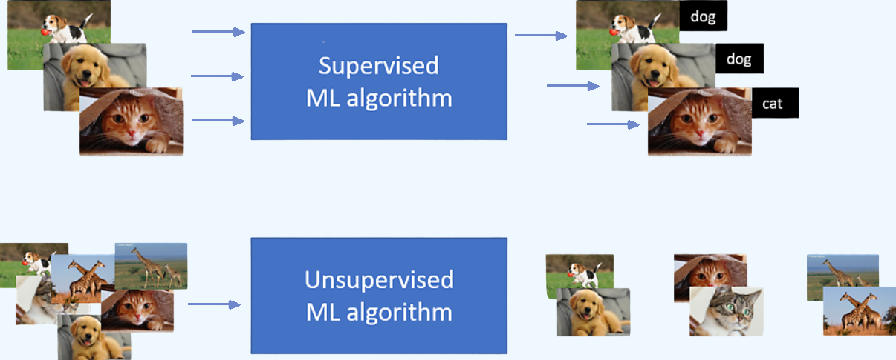

### 위클리\_페이퍼\_09

# 학습종류&손실함수

---

## 1. 지도 학습과 비지도 학습의 차이

### 1-1. 정의

- 지도 학습(Supervised Learning)

  - **정답**이 있는 데이터를 이용해 학습
  - 모델이 **입력 → 출력** 관계를 배우도록 함
  - ex: "사진 → 고양이/개" 분류

- 비지도 학습(Unsupervised Learning)
  - **정답**이 없는 데이터를 이용해 학습
  - 모델이 데이터 속 **패턴·구조**를 스스로 찾음
  - ex: "고객 데이터를 그룹별로 나누기"

### 1-2. 비교 표

| 구분          | 지도학습                              | 비지도학습               |
| ------------- | ------------------------------------- | ------------------------ |
| 데이터        | 정답(레이블) 있음                     | 정답 없음                |
| 목표          | 예측/분류                             | 패턴·구조 발견           |
| 예시 알고리즘 | 선형회귀, 로지스틱 회귀, 랜덤포레스트 | K-평균(K-means), PCA     |
| 활용 사례     | 이메일 스팸 분류, 날씨 예측           | 고객 세분화, 데이터 압축 |

### 1-3. 이해 포인트

- **지도 학습** = 시험 문제 + 정답지 보고 공부하는 것
- **비지도 학습** = 정답 없이 문제만 보고 규칙을 스스로 찾는 것

---

## 2. 손실함수(Loss Function)란?

### 2-1. 정의

- 모델의 예측값이 **정답과 얼마나 다른지** 수치로 나타낸 것

- 손실 값이 **작을수록** 모델이 잘 예측하고 있다는 뜻

### 2-2. 왜 중요한가?

1. **모델 학습의 방향**을 제시  
   → 손실이 작아지는 방향으로 모델이 개선됨

2. **성능 측정 기준** 역할  
   → 어떤 모델이 좋은지 비교 가능

3. **학습 종료 시점 결정**에도 활용

### 2-3. 대표적인 손실함수 예시

| 손실함수                                        | 주로 쓰이는 곳 | 특징                                                               |
| ----------------------------------------------- | -------------- | ------------------------------------------------------------------ |
| **MSE (Mean Squared Error)**                    | 회귀 문제      | 오차를 제곱해 평균                                                 |
| **RMSE (Root Mean Squared Error)**              | 회귀 문제      | MSE의 제곱근, 오차를 **원래 단위**로 해석 가능                     |
| **RMSLE (Root Mean Squared Logarithmic Error)** | 회귀 문제      | 로그 변환 후 RMSE 계산, **비율 차이에 민감**, 과대예측 패널티 완화 |
| **MAE (Mean Absolute Error)**                   | 회귀 문제      | 오차 절대값 평균                                                   |
| **Cross-Entropy Loss**                          | 분류 문제      | 예측 확률과 실제 레이블 비교                                       |

### 2-4. 이해 포인트

- 손실함수 = “예측이 틀린 정도를 측정하는 자”

- 모델 학습 = 손실함수를 최소화하는 과정

- 손실값을 지도 삼아 모델이 점점 똑똑해짐

